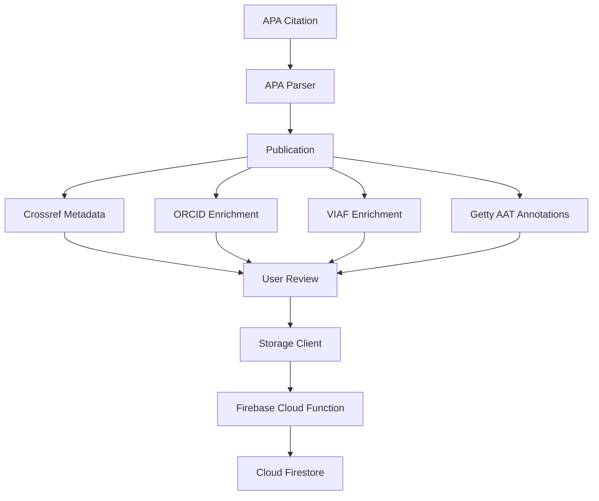

<div align="center">

# Bibliographic Collections

**A desktop application for organizing, enriching, and managing academic publications.**

Bachelor's thesis project built with Python, PySide6 and Firebase.

</div>

---

## About

Bibliographic Collections is a desktop application developed as part of a bachelor's thesis.

The application helps users keep a personal library of academic publications, extract bibliographic metadata from citations, enrich author information through external authority services, add controlled-vocabulary annotations, and store personal notes and tags.

The system keeps the user involved in the process: metadata returned by external services can be reviewed before it is saved.

## Features

- Parse APA-style citations into structured publication metadata.
- Retrieve publication metadata from **Crossref**.
- Enrich authors with **ORCID** and **VIAF** identifiers.
- Add thematic annotations using **Getty AAT**.
- Add personal notes and tags.
- Link the full paper using either a local PDF path or an online URL.
- View, edit, search and delete saved publications.
- Sign in with a Google account.
- Store publications securely through Firebase Cloud Functions and Firestore.

## Technologies

| Area | Technology |
|---|---|
| Language | Python |
| Desktop UI | PySide6 |
| Authentication | Google OAuth, Firebase Authentication |
| Backend | Firebase Cloud Functions |
| Database | Cloud Firestore |
| Publication metadata | Crossref |
| Author identifiers | ORCID, VIAF |
| Controlled vocabulary | Getty AAT |

## Application Workflow



The desktop client does not access Firestore directly. Storage requests are sent to Firebase Cloud Functions together with the authenticated user's Firebase ID token.

## Project Structure

<details>
<summary><strong>Show project structure</strong></summary>

```text
.
├── app.py
├── main_gui.py
├── architecture.txt
├── requirements.txt
│
├── auth/
│   └── firebase_auth.py
│
├── cloud/
│   └── storage_client.py
│
├── config/
│   └── settings.py
│
├── credentials/
│   └── google_oauth_client.json
│
├── data/
│   └── publications/
│
├── functions/
│   ├── main.py
│   └── requirements.txt
│
├── mappers/
│   └── crossref_mapper.py
│
├── models/
│   ├── annotation.py
│   ├── author.py
│   ├── candidates.py
│   └── publication.py
│
├── parsers/
│   └── apa_parser.py
│
├── serializers/
│   └── json_serializer.py
│
├── services/
│   ├── crossref_service.py
│   ├── enrichment_service.py
│   ├── getty_service.py
│   ├── orcid_service.py
│   ├── publication_service.py
│   └── viaf_service.py
│
├── tests/
│   ├── test_apa_parser.py
│   ├── test_crossref_mapper.py
│   └── test_publications.txt
│
└── ui/
    ├── login_window.py
    ├── main_window.py
    ├── theme.py
    │
    ├── dialogs/
    │   └── candidate_dialog.py
    │
    ├── pages/
    │   ├── edit_publication_page.py
    │   ├── new_publication_page.py
    │   ├── publications_page.py
    │   └── view_publication_page.py
    │
    └── widgets/
        ├── full_text_widget.py
        ├── publication_card.py
        └── user_profile.py
```

</details>

## Main Components

**`main_gui.py`**  
Starts the PySide6 application and manages the transition between the login window and the main application window.

**`auth/`**  
Handles Google OAuth and Firebase Authentication.

**`models/`**  
Contains the application's main data models: publications, authors, annotations and search candidates.

**`parsers/`**  
Contains the APA citation parser used to create the initial structured publication data.

**`services/`**  
Contains the logic for Crossref, ORCID, VIAF, Getty AAT and publication enrichment.

**`mappers/`**  
Converts external API responses into the application's internal models.

**`cloud/`**  
Contains the desktop client's communication layer with the Firebase backend.

**`functions/`**  
Contains the Firebase Cloud Functions responsible for authenticated publication storage.

**`ui/`**  
Contains the PySide6 windows, pages, dialogs, reusable widgets and application theme.

## Installation

### 1. Clone the repository

```bash
git clone https://github.com/YOUR_USERNAME/bibliographic-system.git
cd bibliographic-system
```

### 2. Create a virtual environment

Linux / macOS:

```bash
python3 -m venv .venv
source .venv/bin/activate
```

Windows:

```powershell
py -m venv .venv
.\.venv\Scripts\Activate.ps1
```

### 3. Install the dependencies

```bash
pip install -r requirements.txt
```

The desktop client requires:

```text
requests
PySide6
python-dotenv
google-auth-oauthlib
```

> `python-dotenv` provides the `dotenv` Python module, while `google-auth-oauthlib` provides `google_auth_oauthlib`.

## Configuration

Create a `.env` file in the project root:

```env
FIREBASE_API_KEY=
SAVE_PUBLICATION_URL=
LIST_PUBLICATIONS_URL=
DELETE_PUBLICATION_URL=
CROSSREF_EMAIL=
```

Google OAuth credentials are expected at:

```text
credentials/google_oauth_client.json
```

The `.env` file and OAuth credential file should not be committed to the repository.

## Running the Application

Linux / macOS:

```bash
python3 main_gui.py
```

Windows:

```powershell
python main_gui.py
```

The application opens the Google sign-in flow in the user's browser and returns to the desktop client after authentication.

## Data Model

A publication is stored as structured data rather than only as a citation string.

```json
{
  "title": "Example Publication",
  "year": 2026,
  "authors": [],
  "journal": "Example Journal",
  "doi": "10.xxxx/example",
  "metadata_sources": ["crossref"],
  "annotations": [],
  "user_metadata": {
    "notes": "",
    "tags": []
  }
}
```

The application can also keep a reference to the full paper without uploading the file itself.

Local file:

```json
{
  "full_text": {
    "type": "local",
    "location": "/home/user/papers/example.pdf"
  }
}
```

Online location:

```json
{
  "full_text": {
    "type": "url",
    "location": "https://drive.google.com/..."
  }
}
```

## External Services

| Service | Purpose |
|---|---|
| Crossref | Publication metadata |
| ORCID | Researcher identifiers and author information |
| VIAF | Author authority identifiers and alternative names |
| Getty AAT | Controlled vocabulary for thematic annotations |

## Firebase Backend

The application uses a small Firebase backend for authenticated storage.

```text
Desktop Client
      |
      | HTTPS + Firebase ID token
      v
Firebase Cloud Function
      |
      | Token verification
      v
Cloud Firestore
```

Publications are stored per authenticated user:

```text
users/
└── {uid}/
    └── publications/
        └── {publication_id}
```

## Tests

Some components can be tested independently, for example:

```bash
python3 tests/test_crossref_mapper.py
```

Authentication and storage tests may require valid local credentials and network access.

## Current Scope

The current version focuses on a personal academic publication library and metadata enrichment.

Full PDF files are **not uploaded or stored by the application**. A publication may only contain a reference to a local file or an online location.

---

<div align="center">

### Bachelor's Thesis Project

Built as an academic prototype for bibliographic organization, metadata enrichment and controlled-vocabulary annotation.

</div>
